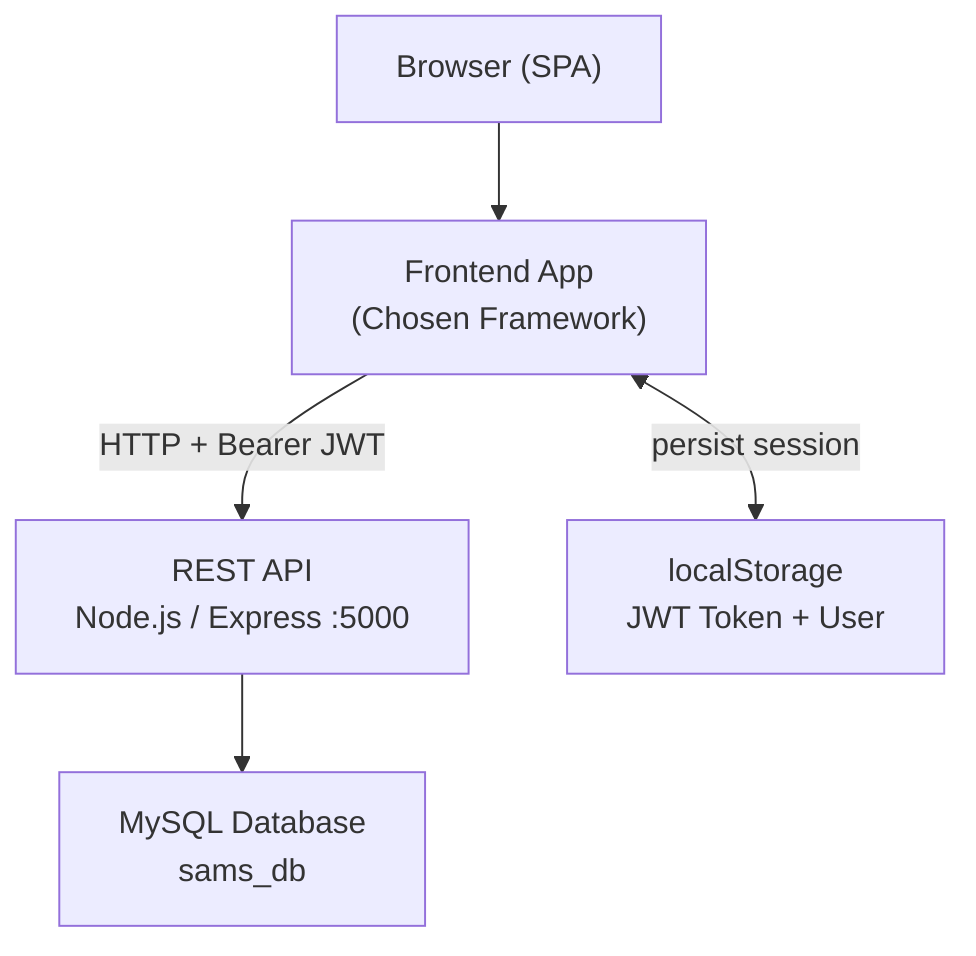
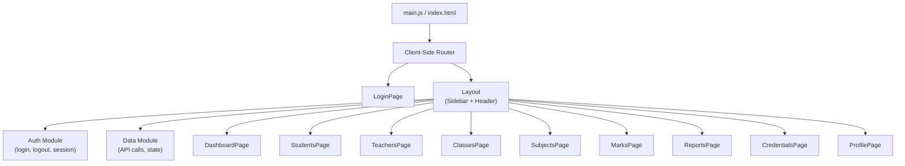
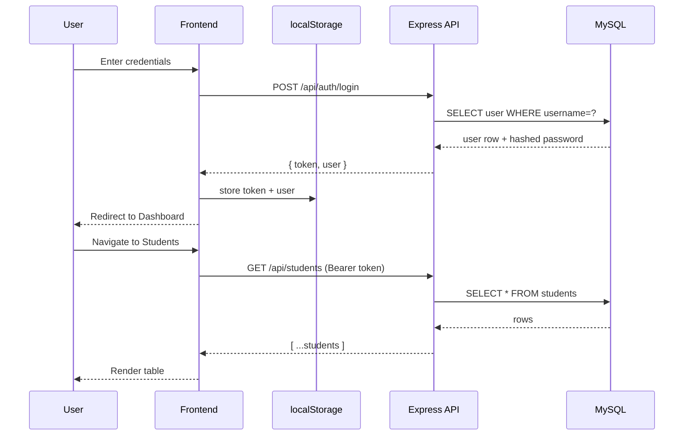

# Design Document: Tech Stack Migration

## Overview

This document covers the migration of the Student Academic Record Management System (SAMS) frontend from its current stack (React + TypeScript + Tailwind CSS + Vite + Radix UI) to a new stack chosen from: HTML, CSS, JavaScript, React, Vue, Angular, Bootstrap, and Tailwind — with no TypeScript.

The backend (Node.js/Express + MySQL) and database schema remain unchanged. Only the frontend is being rebuilt. The migration preserves all existing features: authentication, role-based dashboards (Admin/Teacher/Student), student/teacher/class/subject/marks/reports management, and credential generation.

The user must select a frontend framework and a CSS approach before implementation begins. This design covers all viable combinations and provides a framework-agnostic architecture that applies to any chosen stack.

---

## Tech Stack Options

### Framework Choice

| Option | Description | Best For |
|--------|-------------|----------|
| React (JS) | Component-based SPA, large ecosystem | Teams familiar with current codebase |
| Vue | Progressive framework, gentle learning curve | Clean separation of concerns |
| Angular | Full opinionated framework, built-in DI | Enterprise-scale structure |
| Vanilla JS (HTML/CSS/JS) | No framework, pure browser APIs | Minimal dependencies |

### CSS Choice

| Option | Description |
|--------|-------------|
| Tailwind CSS | Utility-first, same as current project |
| Bootstrap | Component-based, pre-built UI components |
| Plain CSS | Full control, no dependencies |

### Recommended Combinations

- **React + Tailwind** — lowest migration cost, familiar patterns, just drop TypeScript
- **Vue + Bootstrap** — clean architecture, Bootstrap covers most UI needs out of the box
- **React + Bootstrap** — React familiarity + Bootstrap's ready-made components

---

## Architecture

### High-Level System Architecture



### Frontend Internal Architecture



### Request / Response Flow



---

## Components and Interfaces

### Auth Module

**Purpose**: Manages login, logout, JWT persistence, and current user state.

**Interface**:
```javascript
// auth.js
const auth = {
  getUser()          // returns parsed user object or null
  getToken()         // returns JWT string or null
  setSession(user, token)  // persists to localStorage
  clearSession()     // removes from localStorage
  isLoggedIn()       // returns boolean
}
```

**Responsibilities**:
- Read/write `sams_user` and `token` keys in localStorage
- Expose current user role for route guards and nav filtering
- No network calls — purely session management

---

### API Service Module

**Purpose**: Centralised HTTP client. All API calls go through this module.

**Interface**:
```javascript
// services/api.js
const api = {
  // internals
  request(endpoint, options)   // base fetch wrapper with auth header

  // auth
  login(username, password)
  
  // students
  getStudents()
  getStudent(id)
  createStudent(data)
  updateStudent(id, data)
  deleteStudent(id)
  generateStudentCredentials(id, regenerate)

  // teachers
  getTeachers()
  getTeacher(id)
  createTeacher(data)
  updateTeacher(id, data)
  deleteTeacher(id)
  generateTeacherCredentials(id, regenerate)

  // classes
  getClasses()
  createClass(data)
  updateClass(id, data)
  deleteClass(id)

  // subjects
  getSubjects()
  createSubject(data)
  updateSubject(id, data)
  deleteSubject(id)

  // marks
  getMarks(studentId)
  createMarks(marksArray)
  updateMark(id, marksValue)

  // reports
  getStudentReport(studentId, academicYearId)
  getClassReport(classId, academicYearId)

  // reference data
  getDepartments()
  getExamTypes()
  getAcademicYears()
  getMyProfile()
  updateMyProfile(data)
  changeMyPassword(data)
}
```

**Error Handling**:
- Non-2xx responses throw `{ message, status, endpoint }`
- Network failures throw `{ message: 'Unable to reach API', status: 0 }`

---

### Router Module

**Purpose**: Maps URL paths to page components, enforces auth guard.

**Routes**:
```javascript
// routes.js
const routes = [
  { path: '/login',       component: LoginPage,       public: true  },
  { path: '/',            component: DashboardPage,   roles: ['Admin','Teacher','Student'] },
  { path: '/students',    component: StudentsPage,    roles: ['Admin','Teacher'] },
  { path: '/teachers',    component: TeachersPage,    roles: ['Admin'] },
  { path: '/classes',     component: ClassesPage,     roles: ['Admin'] },
  { path: '/subjects',    component: SubjectsPage,    roles: ['Admin'] },
  { path: '/marks',       component: MarksPage,       roles: ['Teacher'] },
  { path: '/reports',     component: ReportsPage,     roles: ['Admin','Teacher','Student'] },
  { path: '/credentials', component: CredentialsPage, roles: ['Admin'] },
  { path: '/profile',     component: ProfilePage,     roles: ['Admin','Teacher','Student'] },
  { path: '*',            component: NotFoundPage,    public: true  },
]
```

**Auth Guard Logic**:
```javascript
// Before rendering any protected route:
// 1. Check auth.isLoggedIn()
// 2. If not logged in → redirect to /login
// 3. If logged in but role not in route.roles → redirect to /
```

---

### Layout Component

**Purpose**: Persistent shell with sidebar navigation and top header, wraps all protected pages.

**Responsibilities**:
- Render role-filtered navigation links
- Show current user name/avatar in header
- Handle mobile sidebar toggle
- Provide logout action

---

## Data Models

These mirror the existing backend response shapes. All IDs are strings on the frontend.

### User (session)
```javascript
{
  id: string,
  name: string,
  role: 'Admin' | 'Teacher' | 'Student',
  email: string,
  username: string,
  profilePhoto: string | null
}
```

### Student
```javascript
{
  id: string,
  firstName: string,
  lastName: string,
  name: string,           // computed: firstName + lastName
  email: string,
  phone: string,
  gender: 'Male' | 'Female' | 'Other',
  classId: number,
  className: string,
  rollNumber: string,
  admissionNumber: string,
  dateOfBirth: string,    // ISO date
  username: string,
  hasCredentials: boolean
}
```

### Teacher
```javascript
{
  id: string,
  firstName: string,
  lastName: string,
  email: string,
  phone: string,
  departmentId: number,
  departmentName: string,
  qualification: string,
  assignedClassIds: string[],
  assignedClassNames: string[],
  homeroomClassId: string,
  username: string,
  hasCredentials: boolean
}
```

### Mark
```javascript
{
  id: string,
  studentId: string,
  subjectId: string,
  classId: string,
  examTypeId: string,
  academicYearId: string,
  marks: number,
  maxMarks: number,
  grade: string,
  examDate: string
}
```

### ClassItem
```javascript
{
  id: string,
  name: string,
  grade: string,
  section: string,
  academicYearId: string,
  homeroomTeacherId: string,
  homeroomTeacherName: string,
  maxStudents: number,
  studentCount: number
}
```

---

## Algorithmic Pseudocode

### Main Application Bootstrap

```pascal
PROCEDURE bootstrap()
  SEQUENCE
    token ← localStorage.getItem('token')
    user  ← localStorage.getItem('sams_user')

    IF token IS NOT NULL AND user IS NOT NULL THEN
      auth.setSession(JSON.parse(user), token)
    END IF

    router.init(routes)
    router.navigate(window.location.pathname)
  END SEQUENCE
END PROCEDURE
```

### Auth Guard

```pascal
PROCEDURE guardRoute(route, user)
  INPUT: route (route config object), user (User | null)
  OUTPUT: allowed destination path

  SEQUENCE
    IF route.public = true THEN
      RETURN route.path
    END IF

    IF user IS NULL THEN
      RETURN '/login'
    END IF

    IF route.roles DOES NOT CONTAIN user.role THEN
      RETURN '/'
    END IF

    RETURN route.path
  END SEQUENCE
END PROCEDURE
```

**Preconditions:**
- `route` is a valid route config object
- `user` is either null or a valid User object with a `role` field

**Postconditions:**
- Returns `/login` when unauthenticated
- Returns `/` when authenticated but unauthorized for the route
- Returns `route.path` when access is permitted

### API Request Function

```pascal
PROCEDURE apiRequest(endpoint, options)
  INPUT: endpoint (string), options (fetch options)
  OUTPUT: parsed JSON response

  SEQUENCE
    token ← localStorage.getItem('token')
    url   ← API_BASE_URL + endpoint

    headers ← { 'Content-Type': 'application/json' }
    IF token IS NOT NULL THEN
      headers['Authorization'] ← 'Bearer ' + token
    END IF

    response ← await fetch(url, { ...options, headers })

    IF response.ok = false THEN
      body ← await response.json()
      THROW { message: body.error OR 'Request failed', status: response.status }
    END IF

    RETURN await response.json()
  END SEQUENCE
END PROCEDURE
```

**Preconditions:**
- `endpoint` starts with `/`
- `API_BASE_URL` is configured

**Postconditions:**
- Returns parsed JSON on success
- Throws error object with `message` and `status` on failure
- Attaches Bearer token when available in localStorage

### Login Flow

```pascal
PROCEDURE login(username, password)
  INPUT: username (string), password (string)
  OUTPUT: void (side effect: session stored)

  SEQUENCE
    setLoading(true)

    TRY
      response ← await api.login(username, password)

      roleMap ← { admin: 'Admin', teacher: 'Teacher', student: 'Student' }

      user ← {
        id:       response.user.studentId OR response.user.teacherId OR response.user.id,
        name:     response.user.name,
        role:     roleMap[response.user.role],
        email:    response.user.email,
        username: response.user.username
      }

      auth.setSession(user, response.token)
      router.navigate('/')

    CATCH error
      displayError(error.message)

    FINALLY
      setLoading(false)
    END TRY
  END SEQUENCE
END PROCEDURE
```

### Data Normalisation

```pascal
PROCEDURE normalizeStudent(raw)
  INPUT: raw (API response object)
  OUTPUT: Student (normalised frontend object)

  SEQUENCE
    firstName ← raw.first_name OR raw.firstName
    lastName  ← raw.last_name  OR raw.lastName

    RETURN {
      id:              String(raw.id),
      firstName:       firstName,
      lastName:        lastName,
      name:            firstName + ' ' + lastName,
      email:           raw.email,
      phone:           raw.phone,
      gender:          raw.gender,
      classId:         raw.class_id OR raw.classId,
      className:       raw.class_name OR raw.className,
      rollNumber:      raw.roll_number OR raw.rollNumber,
      admissionNumber: raw.admission_number OR raw.admissionNumber,
      dateOfBirth:     raw.date_of_birth OR raw.dateOfBirth,
      username:        raw.username,
      hasCredentials:  raw.username IS NOT NULL AND NOT raw.username.startsWith('temp_')
    }
  END SEQUENCE
END PROCEDURE
```

### Student Report Calculation

```pascal
PROCEDURE calculateStudentReport(studentId, students, marks, subjects)
  INPUT: studentId (string), students[], marks[], subjects[]
  OUTPUT: report object

  SEQUENCE
    student ← students.find(s => s.id = studentId)
    IF student IS NULL THEN RETURN null END IF

    studentMarks ← marks.filter(m => m.studentId = studentId)

    marksWithSubjects ← []
    FOR each mark IN studentMarks DO
      subject ← subjects.find(s => s.id = mark.subjectId)
      marksWithSubjects.push({
        subjectName: subject.name,
        marks:       mark.marks,
        maxMarks:    subject.maxMarks OR mark.maxMarks OR 100
      })
    END FOR

    total    ← SUM(studentMarks.marks)
    maxTotal ← SUM(marksWithSubjects.maxMarks)
    average  ← IF maxTotal > 0 THEN (total / maxTotal) * 100 ELSE 0
    status   ← IF average >= 50 THEN 'PASS' ELSE 'FAIL'

    // Calculate rank within class
    classmates ← students.filter(s => s.classId = student.classId)
    ranked ← classmates
      .map(s => { studentId: s.id, total: SUM(marks for s) })
      .sort(descending by total)

    rank ← 1
    FOR i FROM 0 TO ranked.length - 1 DO
      IF ranked[i].total < ranked[i-1].total THEN rank ← i + 1 END IF
      IF ranked[i].studentId = studentId THEN BREAK END IF
    END FOR

    RETURN { student, marksWithSubjects, total, maxTotal, average, status, rank }
  END SEQUENCE
END PROCEDURE
```

**Loop Invariants:**
- All processed marks belong to the target student
- `total` accumulates only valid numeric mark values
- Rank counter only increments when a lower total is encountered

---

## Key Functions with Formal Specifications

### `auth.setSession(user, token)`

**Preconditions:**
- `user` is a non-null object with `id`, `name`, `role`, `email`
- `token` is a non-empty JWT string

**Postconditions:**
- `localStorage['sams_user']` contains JSON-serialised user
- `localStorage['token']` contains the token string
- `auth.isLoggedIn()` returns `true`

---

### `auth.clearSession()`

**Preconditions:** none

**Postconditions:**
- `localStorage['sams_user']` is removed
- `localStorage['token']` is removed
- `auth.isLoggedIn()` returns `false`

---

### `api.request(endpoint, options)`

**Preconditions:**
- `endpoint` is a non-empty string starting with `/`
- Backend server is reachable at `API_BASE_URL`

**Postconditions:**
- On HTTP 2xx: returns parsed JSON body
- On HTTP 4xx/5xx: throws `{ message, status, endpoint }`
- On network failure: throws `{ message: 'Unable to reach API', status: 0 }`
- Token is attached to `Authorization` header if present in localStorage

---

### `router.navigate(path)`

**Preconditions:**
- `path` is a string matching one of the defined route patterns

**Postconditions:**
- Browser URL updates to `path`
- Correct page component is rendered
- Auth guard has been evaluated before rendering

---

## Error Handling

### Scenario 1: Unauthenticated API Request

**Condition**: Token missing or expired; API returns 401  
**Response**: Clear session, redirect to `/login`, show toast "Session expired"  
**Recovery**: User logs in again

### Scenario 2: Network Unreachable

**Condition**: `fetch()` throws (no connection)  
**Response**: Show error banner "Unable to reach the server. Check your connection."  
**Recovery**: Retry on next user action or page focus

### Scenario 3: Form Validation Failure

**Condition**: Required fields empty or invalid before API call  
**Response**: Inline field errors, no API call made  
**Recovery**: User corrects input and resubmits

### Scenario 4: Duplicate Entry (409)

**Condition**: API returns 409 (e.g., duplicate admission number)  
**Response**: Show field-level or toast error with API message  
**Recovery**: User changes conflicting value

### Scenario 5: Unauthorized Route Access

**Condition**: User navigates to a route their role doesn't have access to  
**Response**: Redirect to `/` (dashboard)  
**Recovery**: Automatic

---

## Testing Strategy

### Unit Testing Approach

Test pure functions in isolation:
- `normalizeStudent(raw)` — verify field mapping from snake_case to camelCase
- `normalizeTeacher(raw)` — verify `assignedClassIds` array parsing
- `calculateStudentReport(...)` — verify total, average, rank calculation
- `guardRoute(route, user)` — verify all auth guard branches

**Recommended library**: Jest (works with all framework choices)

### Property-Based Testing Approach

**Property Test Library**: fast-check

Key properties to verify:
- `normalizeStudent` is idempotent: `normalizeStudent(normalizeStudent(raw))` equals `normalizeStudent(raw)`
- `guardRoute` always returns a string path
- `calculateStudentReport` average is always in range [0, 100]
- Marks total never exceeds sum of maxMarks

### Integration Testing Approach

- Mock the API with `msw` (Mock Service Worker) — works in browser and Node
- Test full login flow: submit form → API mock → session stored → redirect
- Test CRUD flows: create student → list refreshes → delete → list updates
- Test role-based nav: Admin sees all links, Student sees only Dashboard/Reports/Profile

---

## Performance Considerations

- Fetch all reference data (classes, subjects, departments, exam types, academic years) once on login and cache in module-level state
- Debounce search/filter inputs (300ms) to avoid re-rendering on every keystroke
- Paginate large tables (students, marks) client-side if record count exceeds 100
- Avoid polling — use `visibilitychange` and `focus` events to refresh stale data, same pattern as current implementation

---

## Security Considerations

- JWT stored in `localStorage` — acceptable for this internal school tool; for higher security, use `httpOnly` cookies (requires backend change)
- All API requests include `Authorization: Bearer <token>` header
- Role check happens both client-side (route guard) and server-side (backend middleware) — never trust client-side alone
- Passwords never stored in frontend state; only the JWT token is persisted
- Credential generation endpoints require Admin role on the backend

---

## Migration Strategy

### Phase 1: Setup

```pascal
SEQUENCE
  1. Create new project with chosen framework + build tool (Vite recommended for React/Vue)
  2. Install CSS framework (Tailwind or Bootstrap)
  3. Configure API base URL via environment variable (VITE_API_URL)
  4. Copy backend/ and database/ directories unchanged
END SEQUENCE
```

### Phase 2: Core Infrastructure

```pascal
SEQUENCE
  1. Implement auth.js module
  2. Implement services/api.js (port from api.ts, remove type annotations)
  3. Implement router with auth guard
  4. Implement Layout shell (sidebar + header)
END SEQUENCE
```

### Phase 3: Pages (in priority order)

```pascal
SEQUENCE
  1. LoginPage
  2. DashboardPage (Admin / Teacher / Student variants)
  3. StudentsPage (CRUD table)
  4. TeachersPage (CRUD table)
  5. ClassesPage
  6. SubjectsPage
  7. MarksPage
  8. ReportsPage
  9. CredentialsPage
  10. ProfilePage
END SEQUENCE
```

### Phase 4: Polish

```pascal
SEQUENCE
  1. Mobile responsive sidebar
  2. Toast notifications
  3. Loading states
  4. Empty states
  5. 404 page
END SEQUENCE
```

---

## Dependencies

### Shared (all combinations)

| Package | Purpose |
|---------|---------|
| Vite | Build tool (recommended) |
| `msw` | API mocking for tests |
| `jest` | Unit testing |

### React + Tailwind

| Package | Purpose |
|---------|---------|
| `react`, `react-dom` | UI framework |
| `react-router-dom` | Client-side routing |
| `tailwindcss` | Utility CSS |
| `@vitejs/plugin-react` | Vite React plugin |

### React + Bootstrap

| Package | Purpose |
|---------|---------|
| `react`, `react-dom` | UI framework |
| `react-router-dom` | Client-side routing |
| `react-bootstrap` | Bootstrap components for React |
| `bootstrap` | Bootstrap CSS |

### Vue + Bootstrap

| Package | Purpose |
|---------|---------|
| `vue` | UI framework |
| `vue-router` | Client-side routing |
| `bootstrap` | Bootstrap CSS + JS |
| `@vitejs/plugin-vue` | Vite Vue plugin |

### Vue + Tailwind

| Package | Purpose |
|---------|---------|
| `vue` | UI framework |
| `vue-router` | Client-side routing |
| `tailwindcss` | Utility CSS |
| `@vitejs/plugin-vue` | Vite Vue plugin |

### Vanilla JS (HTML/CSS/JS)

| Package | Purpose |
|---------|---------|
| Bootstrap or Tailwind | CSS framework |
| No framework router | Use `hashchange` or History API |


---

## Correctness Properties

*A property is a characteristic or behavior that should hold true across all valid executions of a system — essentially, a formal statement about what the system should do. Properties serve as the bridge between human-readable specifications and machine-verifiable correctness guarantees.*

### Property 1: Session set implies isLoggedIn

*For any* valid user object and non-empty JWT token, calling `auth.setSession(user, token)` must result in `auth.isLoggedIn()` returning `true`.

**Validates: Requirements 2.3**

---

### Property 2: Session clear implies not logged in (round-trip)

*For any* session state, calling `auth.clearSession()` must result in `auth.isLoggedIn()` returning `false` and both `localStorage['token']` and `localStorage['sams_user']` being absent.

**Validates: Requirements 2.4, 2.5**

---

### Property 3: API requests carry Bearer token

*For any* API endpoint and any non-empty token stored in localStorage, the request produced by `api.request(endpoint, options)` must include an `Authorization` header with value `'Bearer ' + token`.

**Validates: Requirements 3.2**

---

### Property 4: Non-2xx responses throw shaped error

*For any* HTTP status code outside the 2xx range, `api.request` must throw an object that contains both a `message` string field and a numeric `status` field equal to the response status.

**Validates: Requirements 3.3**

---

### Property 5: Auth guard redirects unauthenticated users

*For any* protected route (one with a `roles` array), calling `guardRoute(route, null)` must return `'/login'`.

**Validates: Requirements 4.1**

---

### Property 6: Auth guard redirects unauthorised roles

*For any* authenticated user and any route whose `roles` array does not include the user's role, `guardRoute(route, user)` must return `'/'`.

**Validates: Requirements 4.2**

---

### Property 7: Auth guard permits authorised access

*For any* authenticated user and any route whose `roles` array includes the user's role, `guardRoute(route, user)` must return `route.path`.

**Validates: Requirements 4.3**

---

### Property 8: Student normalisation is idempotent

*For any* raw student API response object, `normalizeStudent(normalizeStudent(raw))` must produce an object equivalent to `normalizeStudent(raw)`.

**Validates: Requirements 5.5**

---

### Property 9: Student normalisation computes name and hasCredentials correctly

*For any* raw student object, the normalised result must satisfy: `name === firstName + ' ' + lastName`, and `hasCredentials === false` when `username` is `null` or starts with `'temp_'`, and `true` otherwise.

**Validates: Requirements 5.2, 5.3**

---

### Property 10: Report average is always in [0, 100]

*For any* student and any set of marks with non-negative values and non-negative maxMarks, `calculateStudentReport` must return an `average` value in the closed interval `[0, 100]`.

**Validates: Requirements 6.3**

---

### Property 11: Report pass/fail threshold

*For any* student report, `status` must equal `'PASS'` if and only if `average >= 50`, and `'FAIL'` otherwise.

**Validates: Requirements 6.4, 6.5**

---

### Property 12: Role-filtered navigation

*For any* user role, the Layout_Component must render navigation links only for routes whose `roles` array includes that role — no additional links and no missing permitted links.

**Validates: Requirements 7.1**
